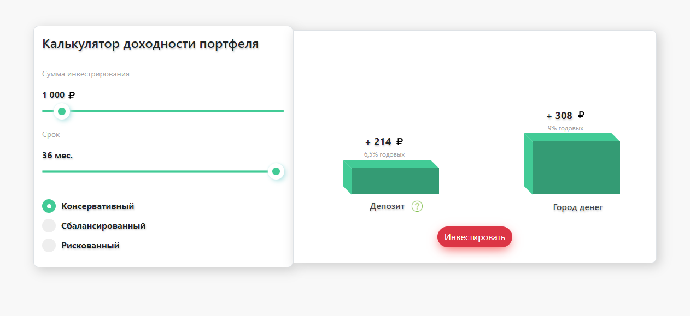

# Single Page Application INVEST-PAGE

  

## Getting Started:

You need to download and install [node.js](https://nodejs.org/en/) on your computer.
In the project directory, you can run:
    
### `npm install`

To install all project dependencies

### `npm start`

To run the app in the development mode.
Open [http://localhost:3000](http://localhost:3000) to view it in the browser.

The page will reload if you make edits. 
You will also see any eslint errors in the console.

### `npm run build`

Builds the app for production to the **build** folder. 
It correctly bundles React in production mode and optimizes the build for the best performance.

The build is minified and the filenames include the hashes. 
Your app is ready to be deployed!

## Main dependencies

* [React.js](https://reactjs.org/)
* [Redux](https://redux.js.org/)
* [Bootstrap 4](https://getbootstrap.com/docs/4.3/getting-started/introduction/)
* [Sass](https://sass-lang.com/documentation)
